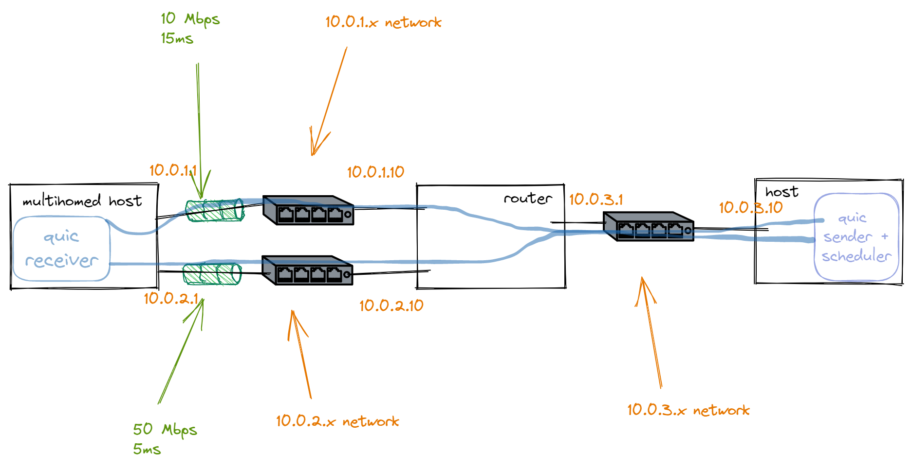

MPQUIC topology testbed
=======================

Multipath QUIC (MPQUIC), is a QUIC extension proposal that enables a QUIC connection to use different paths such as WiFi and LTE on smartphones. When several such paths are active, a MPQUIC sender needs to select for each packet a path to be transmitted. This is done by a packet scheduler, and there are different algorithms used for this, usually considering parameters like RTT, congestion window, etc 

This is a testbed to try different schedulers implementations like the following:

BLEST: (Blocking estimation)
https://dl.ifip.org/db/conf/networking/networking2016/1570234725.pdf

ECF (Earliest completion first)
https://ylim.mybluemix.net/mptcp_ecf/ecf-techreport.pdf

### Topology

### Running topology

sudo python3 ./runner.py -t topo.yaml

Change topo.yaml to define different parameters of bw of delay in each path